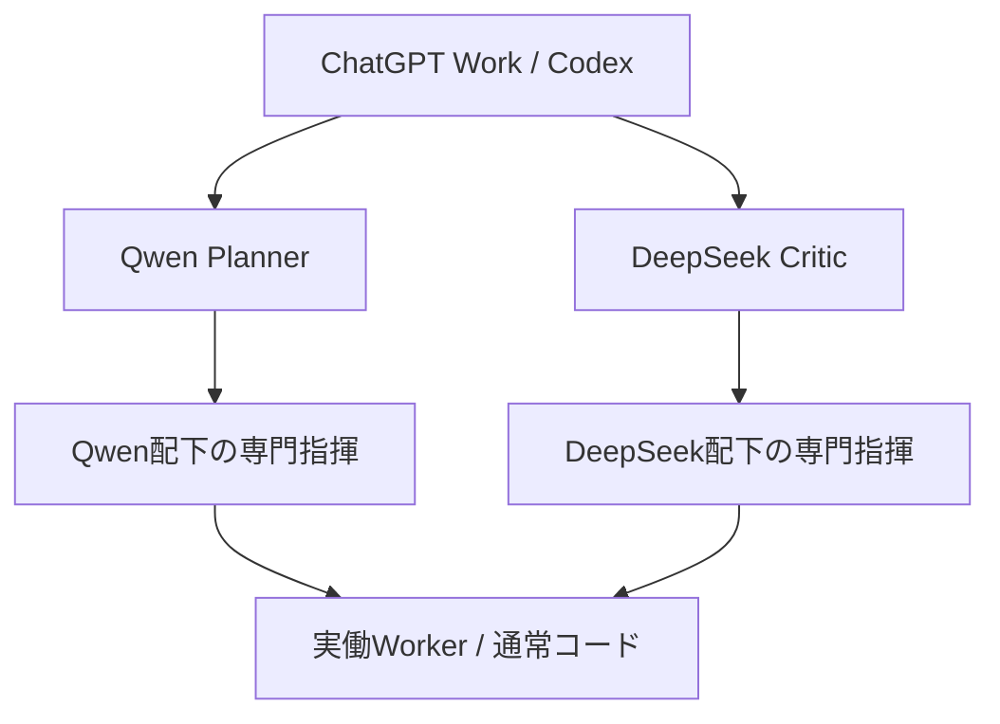

# AI部隊・今後の実行計画書

- 計画版: v1.0
- 作成日: 2026-09-08
- 最高責任者: ChatGPT Work / Codex
- 対象: hf-site-agent の Qwen・DeepSeek 階層型エージェント運用
- 状態: 本番案件へ進む前の低リスク・パイロット計画

## 1. この計画の目的

Qwen と DeepSeek を、単なる評論役ではなく、提案、作業分解、下位Agentへの指示案、成果物ドラフト、レビューを行う上級Agentとして運用する。ただし、最終判断と実行権限は ChatGPT Work に固定する。

最初から重要な本番案件、顧客向けページ、収益判断、公開投稿を渡さない。まず架空の低重要度課題で、命令の正確さ、並列実行、成果物の形式、失敗時の停止、コスト制御を確認する。

## 2. 絶対的な指揮系統

ChatGPT Work が唯一の最高司令部である。Qwen と DeepSeek は同じ上級指揮階級の独立した子Agentとして、同じMissionに対して別々の命令を受ける。

禁止する動作:

- Qwen と DeepSeek が互いに直接命令すること
- 子Agentが親を飛び越えて別の上位Agentへ依頼すること
- 下位Agentが自分で権限を昇格すること
- Agentが独断でGitHub、Cloudflare、Hugging Face、決済、公開先へ書き込むこと
- 重要な結果を、未検証の失敗結果で上書きすること

## 3. 役割分担

| Agent | 主な任務 | 許可範囲 | 最終権限 |
|---|---|---|---|
| ChatGPT Work | Mission定義、命令、採用、統合、実装判断、PR、検証 | 全体の読み取りと承認 | 唯一の最終判断者 |
| Qwen Planner | 需要仮説、業種テンプレート、コンテンツ案、作業分解 | 無料モデルによる提案・下位指示案 | なし |
| DeepSeek Critic | 反対意見、欠落、失敗条件、品質・費用・安全レビュー | 無料モデルによる独立レビュー・下位指示案 | なし |
| 専門指揮Agent | research / product / content / video / code / qa / metrics | 採用された一つのTaskのドラフト | なし |
| Worker | ハッシュ、重複排除、形式検査、集計、成果物整形 | 通常コードと最小Tool | なし |

Qwen配下は research、product、content を優先する。DeepSeek配下は video、code、qa、metrics を優先する。役割の割当は登録済みのAgentSpecだけを使い、モデル出力の自由なAgent名で新しいAgentを生成しない。

## 4. 第1段階: 低リスク・パイロットMission

### 目的

実際の顧客、実在企業、重要なサイト、収益計画を使わず、架空サービスの小さな企画案を作る。これは品質試験であり、市場需要の証明や公開用コンテンツの作成ではない。

### 推奨する最初の課題

- 対象: 架空の「朝の習慣アプリ」
- 課題: 紹介ページの見出しと30秒説明動画の構成案を3案作る
- 調査: 外部検索なし。与えた短い設定だけを使用
- 出力: 需要仮説、利用者メリット、見出し、冒頭フック、失敗条件、確認項目
- 禁止: 実在サービス名、実在人物、個人情報、YouTube投稿、広告、決済、コード変更

この課題を選ぶ理由は、失敗しても本番データや利用者に影響せず、Qwenの企画分解とDeepSeekの批評・検証を同時に確認できるためである。

### パイロットの入力値

Delegation Workflow には次を渡す。

- Branch: main
- confirm: DELEGATE
- Planner: qwen/qwen3-32b:free
- Critic: deepseek/deepseek-chat-v3-0324:free
- Brief: 「架空の朝の習慣アプリの紹介ページと30秒説明動画について、低リスクな改善案を3つ作る。実在サービス・公開・決済・コード変更は扱わない。」
- Context: 「外部検索なし。日本語。各案に目的、入力、成果物、受け入れテスト、リスクを付ける。司令部承認前は実行不可。」

### パイロットで確認すること

1. Qwen と DeepSeek が同じBriefを受け取り、互いの出力を直接参照せずに並列で返す。
2. Qwen が専門Taskを作り、DeepSeek が独立した反対意見と失敗条件を返す。
3. ChatGPT Work が両方をFan-Inし、採用・保留・却下を明示できる。
4. Taskごとに command_id、parent_command_id、owner_agent_id、done_when がある。
5. 生成物がJSON契約を満たし、秘密値や外部書込み命令を含まない。
6. 一方が失敗しても、もう一方の正常な結果を保存できる。
7. 402、429、タイムアウト、形式不正が起きた場合に課金フォールバックせず停止する。

## 5. パイロット後の本運用フロー

### Stage A: Mission準備

ChatGPT Workが、目的、対象利用者、入力、成果物、制約、費用上限、承認要否、完成条件を短く定義する。長い会話をそのままAgentへ渡さず、Context Projectionで必要部分だけにする。

### Stage B: 上級Agentの並列提案

QwenとDeepSeekへ独立命令を同時に送る。Qwenは利用者価値と作業分解、DeepSeekは反対意見と品質条件を担当する。各呼び出しは無料モデルを優先し、固定上限内で終える。

### Stage C: 司令部Fan-In

ChatGPT Workが2つのReport Envelopeだけを受け取り、根拠、危険フラグ、重複、実現性、費用、完成条件を比較する。ここで採用しない提案は下位Agentへ送らない。

### Stage D: 専門Agentへの委任

採用したTaskだけを、親Agentが許可された専門指揮Agentへ渡す。独立Taskは最大並列数の範囲で同時実行し、依存Taskは前段Reportを受け取ってから実行する。

### Stage E: 通常コードによる検査

重複排除、URL検査、文字数、JSON整形、ハッシュ、Status、Retry、Timeout、Cache、IdempotencyはLLMに送らず、Python/JavaScriptで処理する。

### Stage F: 成果物レビュー

司令部がスキーマ、根拠、権利、類似性、安全性、費用、再利用性を検査する。承認前の成果物はdraftとして保存し、公開・外部書込み・決済へ進めない。

### Stage G: 実装と検証

採用したコード変更だけをChatGPT WorkがPR化する。Actions、Workerの/health、既存の安全ゲートを確認し、失敗時は正常な前回成果物を維持する。

### Stage H: 利用者価値の検証

同じ案件を生成→レビュー→承認→更新まで繰り返し、利用回数、再利用率、完了時間、途中離脱、利用者の自由記述を確認する。個人情報を収集せず、当初は端末内の匿名カウンタを使う。

### Stage I: 有料化判断

需要と反復利用が確認できるまでは、決済、収益化設定、自動課金、有料検索を実装しない。将来有料処理を検討する場合も、目的、見積額、上限、代替手段を表示し、別の明示承認を要求する。

## 6. Command / Report の必須条件

### Command Envelope

各命令に次を含める。

- mission_id
- command_id
- parent_command_id
- parent_agent_id
- child_agent_id
- owner_agent_id
- objective
- constraints
- input_refs
- expected_output
- done_when
- token_budget
- time_budget_ms
- tool_scope
- depends_on
- parallel_group
- depth
- max_depth
- may_spawn_children
- idempotency_key

### Report Envelope

各報告に次を含める。

- command_id
- agent_id
- parent_agent_id
- status
- summary
- result
- artifacts
- evidence
- warnings
- errors
- children_used
- duration_ms
- tokens_used
- cache_hit
- tools_used

親へ渡すのは最終Reportと必要なArtifactだけにし、Agentの全会話や中間推論は上位へコピーしない。

## 7. 費用・時間・並列上限

| 項目 | 初期上限 | 動作 |
|---|---:|---|
| 上級Agent呼び出し | 2回/Mission | QwenとDeepSeekを並列、各1回 |
| 出力 | 320 tokens/呼び出し | 無料モデルを優先 |
| タイムアウト | 12秒/呼び出し | 超過時は停止 |
| 自動Retry | 0回 | 429等も勝手な別モデル切替なし |
| 専門Agent | 1Taskあたり500 tokens・15秒 | 採用Taskだけ実行 |
| 検索 | 最大10件 | 無料経路を優先、課金経路は承認待ち |
| 上級Agent並列数 | 2 | QwenとDeepSeekのみ |
| 専門Agent並列数 | 最大4 | 親の予算と依存関係内 |
| Agent深度 | 最大4 | 無限生成禁止 |

有料APIや有料検索を必要とする可能性が出たら、その時点で送信を止め、費用の見積もりを司令部へ報告する。自動チャージは行わない。

## 8. 需要検証の順序

重要度の低いパイロットを通過した後、次の順で段階的に進める。

1. 架空課題で構造・形式・停止条件を検証する。
2. 小規模な業種別テンプレートを3種類作る。
3. 引用付きコンテンツ計画を無料検索の範囲で作る。
4. 生成→レビュー→承認→更新を同一案件で繰り返す。
5. 利用回数、レビュー完了率、7日後の再利用率、引用計画の再利用率を測る。
6. 利用者が実際に解決した課題と時間短縮を記録する。
7. 需要が確認できた場合だけ、有料プランの仮説を設計する。

YouTubeの人気傾向は、必要な場合に企画・調査の材料として扱う。ただし、投稿、自動公開、広告出稿、収益化設定はこの計画の実行対象に含めない。

## 9. 採用基準と停止基準

### 採用基準

- Command / Report のスキーマが有効
- 親子関係とTool権限が登録表に一致
- 目的、入力、成果物、完成条件、リスクが明記されている
- 根拠または根拠不足が明示されている
- 秘密値、公開命令、課金命令を含まない
- 正常な部分成果を保存できる
- Actionsと必要な安全検査が成功する

### 即時停止

- HTTP 402、支払い要求、課金が発生する可能性
- APIキー、トークン、パスワードの露出
- 不明なURL、危険なスクリプト、未検証の外部命令
- 親子関係違反、横向き・上向きの委任
- スキーマ不正、重複Command、予算超過
- 権利状態が確認できない素材
- YouTube等への投稿・公開を要求する命令

停止した場合は、失敗理由だけを安全に圧縮して親へ返し、正常な既存成果物を保持する。

## 10. 測定する指標

### 実行効率

- 総トークン数
- LLM呼び出し数
- Mission完了時間
- Agent生成数と平均深度
- 平均子Agent数
- 並列処理率
- Cache hit率
- 重複Command数
- 再処理数
- ContextとTool schemaのトークン数
- 失敗率、部分失敗率
- Checkpoint再開率

### 利用価値

- 初回生成からレビューへ進んだ割合
- レビューから承認へ進んだ割合
- 7日後の更新再利用率
- 引用付き計画の再利用率
- 完成までの時間短縮
- 解決した業務課題
- 利用者からの再利用要求

初期パイロットでは性能比較を断定しない。最低限の実行記録を蓄積してから、旧方式との品質・速度・費用を比較する。

## 11. 次の実行単位

1. この計画書をmainへ反映する。
2. 架空の「朝の習慣アプリ」BriefでQwen/DeepSeekを一度だけ並列実行する。
3. 司令部が2つのReportをFan-Inし、Taskを採用・保留・却下する。
4. 採用Taskを1〜2件だけ専門Agentへ渡す。
5. 成果物と指標を保存する。
6. 失敗がなければ、実在案件ではなく、さらに低リスクな業種テンプレートへ進む。
7. 需要が確認できるまで、公開・決済・収益化は行わない。

## 12. 既存OSSの扱い

MoneyPrinterTurbo、smolagents、Pydantic/JSON Schema、FFmpeg/MoviePy/Whisperは、工程分離、型付き入出力、決定的処理の設計参考として使う。ライセンス確認なしのコードコピー、不要な依存追加、本番Workerへの重い処理導入は行わない。

参考:

- https://github.com/harry0703/MoneyPrinterTurbo
- https://github.com/huggingface/smolagents
- https://pydantic.dev/docs/validation/dev/concepts/json_schema/
- https://zulko.github.io/moviepy/

関連実装: docs/HIERARCHICAL_RUNTIME.md、docs/AI_COMMANDER_OPERATING_RULES.md、docs/AGENT_HIERARCHY.md