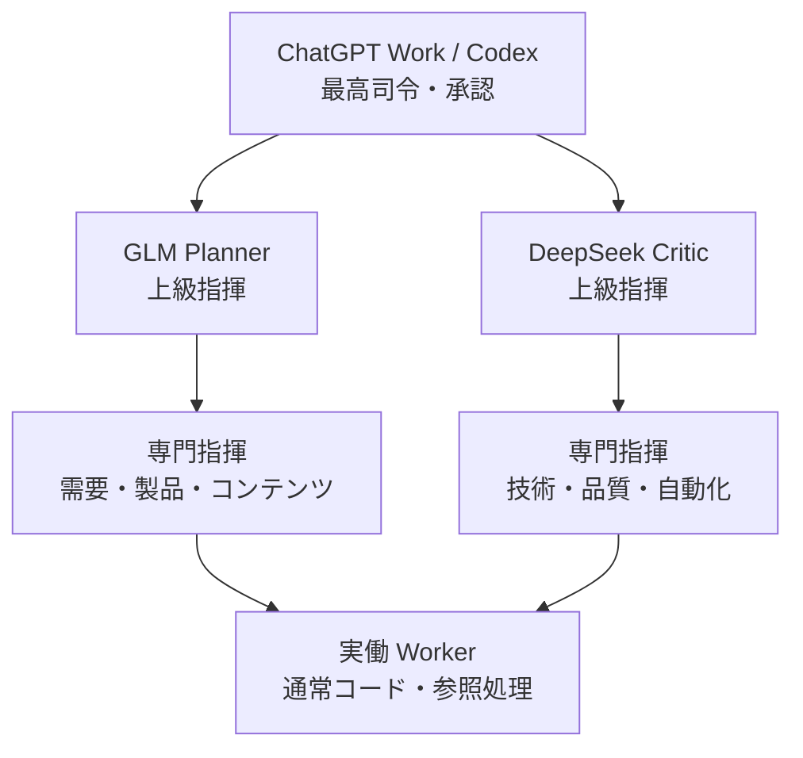

# 階層型AI部隊ランタイム

この文書は、現在の `hf-site-agent` における指揮系統と、効率最大化のために導入した実行基盤を固定する。ここでいう Agent は、モデルそのものではなく、命令と権限を持つ実行上の役割である。

## 現在の指揮系統

最高司令権は ChatGPT Work／Codex に残す。GLM と DeepSeek は同じ上級指揮階級として、ChatGPT Work から独立した命令を受けて並列に動く。各々が許可された専門指揮 Agent へ Fan-Out し、ChatGPT Work が結果を Fan-In する。同格 Agent の自由な指揮権移譲や直接接続はない。

| 階級 | `agent_id` | 親 | 任務 | 子へ渡せる範囲 |
|---|---|---|---|---|
| 最高司令 | `chatgpt-work` | なし | Mission 解釈、承認、統合、最終実行判断 | `glm-general-commander` と `deepseek-engineering-commander` |
| 上級指揮 | `glm-general-commander` | `chatgpt-work` | 需要・製品・コンテンツ側のMission分解 | research / product / content の専門指揮 |
| 上級指揮 | `deepseek-engineering-commander` | `chatgpt-work` | 技術・品質・自動化側の独立レビュー | video / code / qa / metrics の専門指揮 |
| 専門指揮 | `<role>-specialist` | `glm-general-commander` または `deepseek-engineering-commander` | 一つの承認済み Task を下位作業へ分解 | 同じ役割の `<role>-worker` のみ |
| 実働 | `<role>-worker` | `<role>-specialist` | 小さな通常コード・参照処理 | 子 Agent なし |

現在の全専門役割は `scripts/agent_runtime.py` の `default_agent_specs()` を唯一の登録表とする。登録表にない Agent は実行できない。

命令は上から下へ、報告は下から上へ流れる。Worker は親を飛び越えず、失敗時は `blocked` / `failed` として親へ返す。YouTube 投稿、決済、課金を伴う操作、秘密値・Durable Object・既存バインディング変更はこのランタイムの権限外である。

## 構造化された命令と報告

`schemas/command_envelope.schema.json` と `schemas/report_envelope.schema.json` を公開形式とし、実行時には `scripts/agent_runtime.py` が JSON Schema では表現しにくい親子関係・ツール許可・予算を追加検証する。

Command Envelope の主な追跡項目は次の通り。

- `mission_id`, `command_id`, `parent_command_id`
- `parent_agent_id`, `child_agent_id`, `owner_agent_id`, `rank`, `role`
- `objective`, `constraints`, `input_refs`, `expected_output`, `done_when`
- `token_budget`, `time_budget_ms`, `tool_scope`, `permissions`
- `depends_on`, `parallel_group`, `priority`, `depth`, `max_depth`
- `may_spawn_children`, `allowed_child_roles`, `idempotency_key`, `status`

Report Envelope は会話全文ではなく、`summary`、`result`、`artifacts`、`evidence`、`warnings`、`errors`、`children_used`、実行時間・トークン数・Cache hit・利用 Tool だけを親へ返す。これにより上位へ上がるほど報告を圧縮できる。

## 効率・安全の実装

`CommandRuntime` はモデル呼び出しを行わず、次の決定的処理を担当する。

1. **Dispatcher / Queue** — 登録済みの直接の子だけをキューへ入れ、上向き・横向きの命令を拒否する。
2. **Fan-Out / Fan-In** — 同じ親・同じ `parallel_group` の独立 Task を、親の `max_children`（最大5）と `max_parallel`（最大4）の範囲で並列化する。部分失敗時も成功した Report を保持し、`completed_with_warnings` で統合する。
3. **Budget / Idempotency** — Mission 予算を予約・精算し、`command_id` を重複実行防止キーとして使う。
4. **Artifact Store** — 長い本文を Prompt にコピーせず、内容アドレス型 `artifact_id` だけを渡す。書き込みは安全な一時ファイル置換を使う。
5. **階層 Cache / Checkpoint** — global / mission / commander / worker の Cache と、Mission／Stage 単位の Checkpoint を用意する。
6. **Context Projection / Compaction** — 子へは `MISSION`、`CONSTRAINTS`、`RELEVANT_STATE`、`INPUT_REFERENCES`、`OUTPUT_SCHEMA` だけを渡し、古い会話・無関係な Tool schema を除外する。
7. **Least Privilege** — 研究、コード、QA、動画計画など役割ごとに `allowed_tools` を分離する。Worker は読み取り・成果物・Trace のみ。
8. **Trace / Progress / Cancellation** — 命令の開始・進捗・完了・失敗・取消を通常コードで記録し、親の取消を子へ伝播する。Trace に Prompt や秘密値は保存しない。

単純な重複排除、ハッシュ、Status 判定、予算、再試行・タイムアウトの管理は LLM に送らない。意味判断が必要な箇所だけ既存の GLM / DeepSeek アダプタへ渡す。

## 段階的導入状況

| Phase | 内容 | 状態 |
|---:|---|---|
| 1 | 現行階層の可視化 | 実装済み（本書と登録表） |
| 2 | 決定的処理の分離 | 実装済み（ランタイム基盤） |
| 3 | Command / Report Envelope | 実装済み |
| 4 | 親子・Tool・Budget 権限制御 | 実装済み |
| 5 | Fan-Out / Fan-In | 実装済み（上限付き） |
| 6 | Cache / Artifact / Checkpoint | 実装済み（永続化可能なプリミティブ） |
| 7 | Context 階層化・Compaction | 実装済み（投影関数） |
| 8 | Tool Scope / Preset 分離 | 実装済み（AgentSpec） |
| 9 | Queue / Idempotency / Cancellation | 実装済み（インメモリ基盤、外部 Queue は未接続） |
| 10 | Trace / Observability | 実装済み（安全な JSONL／メモリ Trace） |
| 11 | 総合テスト | 本 PR の標準ライブラリテストで検証 |
| 12 | 性能比較 | 次段階。実運用データを収集してから比較 |

外部 AI は提案・批評・下書きを担当するだけで、最終承認、GitHub 書き込み、デプロイ、公開は ChatGPT Work 側の明示許可が必要である。既存 OSS の設計知見（例: [smolagents](https://github.com/huggingface/smolagents)、[MoneyPrinterTurbo](https://github.com/harry0703/MoneyPrinterTurbo)）は参考にするが、依存導入や自動公開は行わず、既存本番の契約を優先する。

## 測定項目

`CommandRuntime.metrics()` は、総トークン、LLM 呼び出し数、Mission 時間、Agent 数、平均深度・子数、並列率、Cache hit 率、重複・再処理数、失敗率、部分失敗率、Checkpoint 再開率、予算と Status 集計を返す。Phase 12 では現行 Workflow のベースラインと同じ Mission を比較し、品質低下がない場合だけ次の実装段階へ進める。
