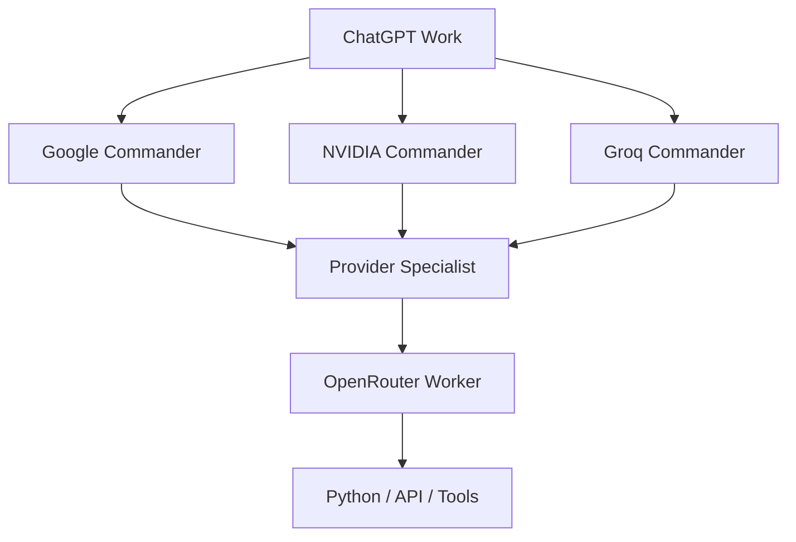

# 階層型AI部隊ランタイム

このプロジェクトのAgentはモデル名ではなく、親子関係・権限・予算を持つ実行上のRoleです。指揮権は `chatgpt-work` に残し、命令は下向き、Reportは上向きにのみ流します。Peer間の委任、Swarm、多数決、失敗時の自動昇格はありません。

## 現行階層

| 階級 | `agent_id` | Provider | 親 | 主な担当 |
|---|---|---|---|---|
| 最高司令 | `chatgpt-work` | Work | なし | Mission解釈、承認、統合、最終判断 |
| 直属Commander | `google-general-commander` | Google | `chatgpt-work` | Research、Planning、長文書、Multimodal、情報統合 |
| 直属Commander | `nvidia-engineering-commander` | NVIDIA | `chatgpt-work` | Repository、Coding、Debug、Test、Infrastructure |
| 直属Commander | `groq-rapid-commander` | Groq | `chatgpt-work` | 高速要約、分類、抽出、JSON、ログ一次判定 |
| Specialist | `<role>-specialist` | 親Provider | 直属Commander | 承認済みTaskの分解・下書き |
| Worker | `<role>-worker` | OpenRouter | Specialist | 低リスク・限定範囲の実働 |

`scripts/agent_runtime.py` の `default_agent_specs()` が有限の登録表です。現在の全Roleは `active=false`、`requires_explicit_approval=true` で初期化されます。Workerは子Agentを生成できず、各Agentの `max_children`、`max_parallel`、`max_depth` は有限です。

同じTaskを3Providerへ常時送らず、通常は適任Providerを1つだけ選びます。独立検証が必要な場合のみPrimary＋Verifierの2経路まで許可します。OpenRouterはWorker Providerであり、ChatGPT Work直属Commanderにはなりません。

## Command / Report契約

公開契約は [`schemas/command_envelope.schema.json`](../schemas/command_envelope.schema.json) と [`schemas/report_envelope.schema.json`](../schemas/report_envelope.schema.json) です。RuntimeはSchemaに加えて親子Edge、Tool Scope、Rank、Budget、Owner、Cancellationを検証します。

Commandには `mission_id`、`command_id`、`parent_command_id`、`parent_agent_id`、`child_agent_id`、`owner_agent_id`、`provider_preference`、`objective`、`constraints`、`artifact_refs`、`tool_scope`、`request_budget`、`token_budget`、`deadline`、`may_spawn_children`、`idempotency_key`、`side_effect_level` を記録します。

Reportは会話全文を上へコピーせず、`summary`、`result`、`artifacts`、`evidence`、`warnings`、`errors`、`children_used`、Provider/Model、usage、quota、Cache hitを返します。処理不能時は `blocked` を返し、正常成果やCheckpointを上書きしません。

## Runtimeの決定的処理

1. Queueは直接の許可された子だけを受け付け、上向き・横向きの命令を拒否します。
2. Fan-Outは独立Taskだけを対象にし、`max_children`、`max_parallel`、MissionのProvider request budgetを送信前に予約します。
3. Cancellationは `mission_id` または親子Commandの祖先関係で限定し、Sibling・別Mission・completed/failed Reportを変更しません。
4. Idempotencyは `mission_id`、`command_id`、`idempotency_key`、`operation_type`、`payload_hash` を永続可能な台帳へ保存します。同じKeyでPayloadが違う場合は `IDEMPOTENCY_CONFLICT`、Timeout後は安全側で再実行しません。
5. Artifactは内容ハッシュをIDとして渡し、CacheはGlobal / Mission / Commander / Workerの層で照合します。長時間MissionはStageごとにCheckpointを保存します。
6. URL、重複排除、Sort、Hash、JSON/Schema検証、HTTP Status、Retry、Quota、Queue、Cache照合は通常コードで処理し、LLMには意味判断だけを渡します。

## ProviderとModel

Provider Registryは Google、NVIDIA、Groqを `COMMANDER_PROVIDER`、OpenRouterを `WORKER_PROVIDER` として分離します。現在は全Providerが `enabled=false`、`probe_status=NOT_RUN` です。成功Probe、健全性確認、Circuit CLOSED、明示承認が揃うまで有効化できません。

Model RegistryはRoleとModel IDを分離します。新3CommanderのModel IDは現行公式Catalogと実Endpointを確認するまで空欄で、推測登録しません。OpenRouter Workerは `scripts/probe_free_workers.py` が現行Catalogから候補を取得し、正確な `:free` ID、価格0、必要能力、Context、応答Model一致、`usage.cost=0`、Credits不変、Fallbackなしを満たしたものだけを選びます。

Worker実行は手入力Modelを信頼しません。`agent_executor.py` は別ArtifactのProbe ReportとSpecialist→Worker Role対応を照合し、Provider/Roleの明示承認、共通Adapter、OpenRouter専用Ledgerを通過した場合だけ一件を送信します。

`FREE_ONLY_MODE=true`、Paid Model/Fallback/Web Search/Auto top-upはOFFです。OpenRouter専用には既存の日次1000、900 Hard Stop、15 RPM、429 Circuit Stopを保持し、Google/NVIDIA/Groqへ同じ数字を流用しません。Quota不明は無制限利用ではなく停止条件です。

## 旧構成と導入状態

旧Qwen/DeepSeek等の固定Commander経路は `LEGACY_DISABLED` として隔離し、新Routingの候補ではありません。既存の専門Role名は互換再利用しますが、現在のProvider Commander・Specialist・Workerは未承認状態です。

基盤のCancellation、Idempotency、Secret監査、Provider Registry、共通Adapter、Quota/Circuit、Routing、Dynamic Worker選定はローカル契約テストで検証します。実Provider Probe、20〜50件の実Mission比較、Roleの `active=true`、本番切替は未実施で、最終承認後の別段階です。
