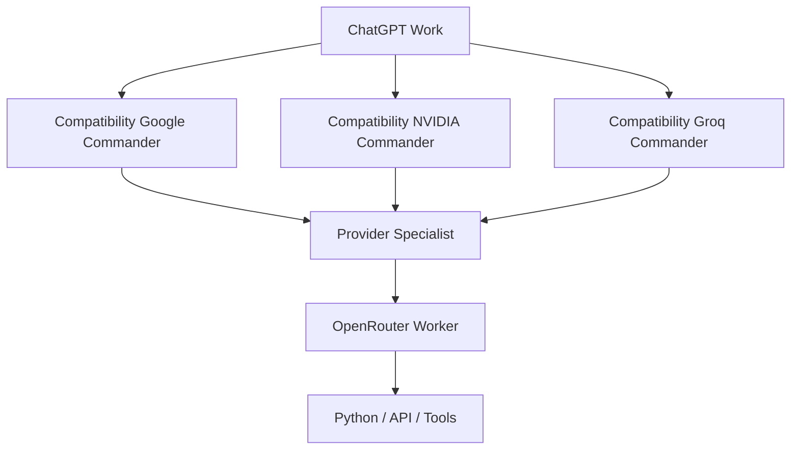

# 階層型AI部隊ランタイム — Compatibility Implementation Reference

> **Status: LEGACY_COMPATIBILITY_IMPLEMENTATION_DOC / NOT POLICY AUTHORITY**
>
> この文書は `scripts/agent_runtime.py` 周辺の互換ランタイム実装・回帰検証を理解するために残す技術資料です。現在のAI Armyの指揮権、Provider選択、有料実行権限、Delegation方針を決定するSource of Truthではありません。
>
> 現行Policy Authorityは `config/current_commander_handoff.json` → `config/permanent_standards_manifest.json` → `docs/AI_ARMY_MASTER_RULEBOOK.md` と、Manifestが指すMachine-readable Policy / Validator / CIです。新しいPolicy-facing routingは `scripts/ai_army_routing_facade.py` を入口とし、ChatGPT / WorkがTop Commander、DeepSeekはScoped Executive Supervisor、狭い処理ではDirect SpecialistまたはDeterministic Tool bypassを使用できます。
>
> 以下のGoogle / NVIDIA / Groq Commander → Specialist → OpenRouter Worker構造は、既存互換ランタイムの実装モデルを説明するものです。これだけを根拠にProviderを有効化したり、現在のrouting authorityへ昇格したりしてはいけません。

この互換ランタイムではAgentをモデル名ではなく、親子関係・権限・予算を持つ実行上のRoleとして扱います。指揮権は `chatgpt-work` に残し、命令は下向き、Reportは上向きにのみ流します。Peer間の委任、Swarm、多数決、失敗時の自動昇格はありません。

## 互換ランタイム階層

| 階級 | `agent_id` | Provider | 親 | 主な担当 |
|---|---|---|---|---|
| 最高司令 | `chatgpt-work` | Work | なし | Mission解釈、承認、統合、最終判断 |
| 互換Commander | `google-general-commander` | Google | `chatgpt-work` | Research、Planning、長文書、Multimodal、情報統合 |
| 互換Commander | `nvidia-engineering-commander` | NVIDIA | `chatgpt-work` | Repository、Coding、Debug、Test、Infrastructure |
| 互換Commander | `groq-rapid-commander` | Groq | `chatgpt-work` | 高速要約、分類、抽出、JSON、ログ一次判定 |
| Specialist | `<role>-specialist` | 親Provider | 互換Commander | 承認済みTaskの分解・下書き |
| Worker | `<role>-worker` | OpenRouter | Specialist | 低リスク・限定範囲の実働 |

`scripts/agent_runtime.py` の `default_agent_specs()` がこの互換ランタイムの有限登録表です。Roleの `active` / approval状態は実装と現行Registryを実行時に確認し、この文書の記述から有効状態を推測しません。Workerは子Agentを生成できず、各Agentの `max_children`、`max_parallel`、`max_depth` は有限です。

この図は互換実装のTopologyであり、現在のPolicy-facing routing決定図ではありません。同じTaskを3Providerへ常時送らず、独立検証が必要な場合もMachine Oracle / deterministic validatorを優先します。

## Command / Report契約

公開契約は [`schemas/command_envelope.schema.json`](../schemas/command_envelope.schema.json) と [`schemas/report_envelope.schema.json`](../schemas/report_envelope.schema.json) です。RuntimeはSchemaに加えて親子Edge、Tool Scope、Rank、Budget、Owner、Cancellationを検証します。

Commandには `mission_id`、`command_id`、`parent_command_id`、`parent_agent_id`、`child_agent_id`、`owner_agent_id`、`provider_preference`、`objective`、`constraints`、`artifact_refs`、`tool_scope`、`request_budget`、`token_budget`、`deadline`、`may_spawn_children`、`idempotency_key`、`side_effect_level` を記録します。

Reportは会話全文を上へコピーせず、`summary`、`result`、`artifacts`、`evidence`、`warnings`、`errors`、`children_used`、Provider/Model、usage、quota、Cache hitを返します。処理不能時は `blocked` を返し、正常成果やCheckpointを上書きしません。

## Runtimeの決定的処理

1. Queueは直接の許可された子だけを受け付け、上向き・横向きの命令を拒否します。
2. Fan-Outは独立Taskだけを対象にし、`max_children`、`max_parallel`、MissionのProvider request budgetを送信前に予約します。
3. Cancellationは `mission_id` または親子Commandの祖先関係で限定し、Sibling・別Mission・completed/failed Reportを変更しません。
4. Idempotencyは `mission_id`、`command_id`、`idempotency_key`、`operation_type`、`payload_hash` を永続可能な台帳へ保存します。同じKeyでPayloadが違う場合は `IDEMPOTENCY_CONFLICT`、Timeout後は安全側で再実行しません。
5. Artifactは内容ハッシュをIDとして渡し、CacheはGlobal / Mission / Commander / Workerの層で照合します。長時間MissionはStageごとにCheckpointを保存します。
6. URL、重複排除、Sort、Hash、JSON/Schema検証、HTTP Status、Retry、Quota、Queue、Cache照合は通常コードで処理し、LLMには意味判断だけを渡します。

これらのCommand/Report、Cancellation、Idempotency、Checkpoint、bounded execution原則は現行Policyでも価値があるため、この文書を残す主な理由です。

## Provider / Modelに関する注意

この互換ランタイムには、Google / NVIDIA / GroqをCommander Provider、OpenRouterをWorker Providerとして扱う実装・テストが残っています。それは**現在のProvider readiness、無料枠、Exact Model ID、Quota、routing authorityを証明しません**。

Provider / Modelの実行可否は毎回、現行Registry、exact route evidence、cost/quota evidence、Policy、Probe結果を確認してください。古い文書に記録されたModel IDやRPM/RPD/日次上限を現在値として流用してはいけません。UnknownはFail Closedです。

OpenRouter等について過去に使用した数値上限やHard Stopは、当時の互換実装・回帰検証条件としてコードや履歴に残る場合があります。現在の外部Provider条件を意味しないため、実Provider利用前に最新の公式・アカウントEvidenceを再確認します。

## 現行Policyとの境界

- ChatGPT / Workが最終Authorityです。
- Paid DeepSeekの実行権限は `config/deepseek_paid_supervisor_policy.json` とcanonical supervisor workflowのScoped Exceptionだけです。
- 互換Commander定義はDeepSeek Supervisor、Direct Specialist bypass、Deterministic Tool bypassを上書きしません。
- 旧Registryやhistorical `enabled` flagは実行権限になりません。
- `FREE_ONLY_MODE`等の既定安全境界、Auto Top-up禁止、Generic Paid Fallback禁止を維持します。
- Provider readiness / quota / costは古い文書から推測せず、fresh evidenceを要求します。
- main Push、PR Merge、Deploy、Publish、Secrets操作等はHuman Approval Gateを維持します。

この文書は互換実装を削除せず安全に保守・回帰検証するための資料であり、新規セッションのBootstrap文書としては使用しません。
